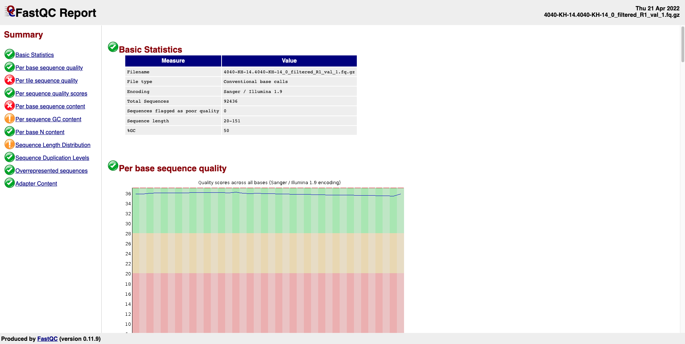

# Preprocessing RNA_Sequencing for Analysising of Gene Expression Differentiation Following Environmental Stressors

Next generation sequencing has provided opportunities to understand the molecular and genomic consequences of climate change induced environmental stressors on organisms. Specifically, RNA-seq has enabled us to understand what genes are being up- or down-regulated in response to these stressors. By analyzing gene expression data, we have a much greater understanding of the physiological consequences that have been previously described in many model species. 

In this script we will first assess the quality of the reads through FASTQC to identify the adaptor sequence to remove. We will then use TrimGalore! to remove the adaptor sequence and re-run FASTQC to ensure that the data was trimmed properly. Next, we need to index the reference genome (provided by the link above) to prepare for alignment. After indexing, the script aligns the trimmed sequences (fastq files) to the reference genome.

You will need the following in order to run the script:
-raw FASTA files
-Reference Genome (Genome sequence (GRCm39) (FASTA format)
    -- (we used the reference genome from https://www.gencodegenes.org/mouse/)
-Comprehensive gene annotation (GTF or GFF3 format)
    -- can also be found on https://www.gencodegenes.org/mouse/

FUTURE STEPS:
After finishing this script, the data is ready to be used to identify differentially expressed genes through programs like DEseq


## Project Objectives

In this project, **bash** scripts were developed:

1. Check the quality of the reads
2. Clean reads
3. Index the genome
4. Map the reads to a reference genome
5. Get read counts per gene

These analyses will consist of RNA-seq data extracted from the common mouse species, *Mus musculus*, that was exposed to two separate treatment groups. 

## Table of Contents
[**Environment and Usage**](#environment-and-usage)  
[**Steps and functions**](#steps-and-functions)  
  1. Check the quality of the reads using function: [FASTQC_raw](#FASTQC-raw)
  2. Clean reads using function: [trim_reads](#trim-reads)  
  3. Check the quality of the trimmed reads using function: [FASTQC_trimmed](#FASTQC-trimmed)
  4. Mapping the genome using function: [mapping](#mapping)
   

# Environment and Usage
_**RNS_Sequencing requires Alabama Super Computer**. You can request an new or existing account from [ASC](https://www.asc.edu/hpc/ASA-HPC-Annual-Grant-Request-Form). Highly recommand to email them if you need to contact them._

- To run the RNA_Sequencing utility, **set up your ASC account** and run from ASC 

```  
$ ssh your_asc_account@dmc.asc.edu
```  
- **Upload** files from local to ASC using `scp`
```  
$ scp your_local_path_of_files your_asc_account@dmc.asc.edu:~/path_of_the_directory_you_want_to_paste_into
```
- Once you login, **submit** jobs to ASC to run your scripts

```  


https://user-images.githubusercontent.com/91216328/164949011-7358eb93-f115-46cb-a49a-2960e5687bc9.mp4


$ chmod +x my_scripts
$ run_script my_scripts
``` 
- **Download** files from ASC to local (need to exit ASC: use `exit` to exit ASC)
```  
$ scp  your_asc_account@dmc.asc.edu:~/path_of_the_files_in_ASC path_of_dir_in_local
```
- **Unzip** the `.zip` file into the same director
```  
$ unzip path_of_files
```

https://user-images.githubusercontent.com/91216328/164944932-936fce64-9bba-45df-a3b1-02e1c4d6cfbc.mp4

# Steps and functions
## Step 1.
### FASTQC-raw 
| [Description](#description) | [Usage](#usage) | [Input Format](#input-format) | [Output Format](#output-format) |
|---|---|---|---|

### Description
`quality_check` is a first essential step in bioinformatics analysis of RNA-Seq data because sequencing errors and contaminations may be introduced into the raw data during the library preparation, sequencing and base calling steps. This function needs to load `fastqc` module. 
### Usage

Running the `FASTQC-raw` function requires an output path. 

```
$ FASTQC-raw /home/asc_account/path_to_your_output_folder 
``` 
Using module `fastqc` requires input files, `-o` output_folder, and an output folder 
```
$ fastqc path_of_the_folder/*.fastq.gz -o path_of_output_folder
```
### Input Format
**[Sample input file](sample_data/raw_data/4040-KH-17.4040-KH-17_0_filtered_R1.fastq.gz)**

|   |Input should be formatted as a compressed fastq file showing as `.fastq.gz`. The fastq file format:|
|---|---|
|line1|Unique read ID.|
|line2|The sequence.|
|line3|A separator, which is simply a plus (+) sign.|
|line4|The base call quality scores.|
### Output Format
#### In terminal


**[Sample output file](sample_data/quality_check_output/4040-KH-14.4040-KH-14_0_filtered_R1_fastqc.html)**

Output is  a `.html` file with the following columns. It can be downloaded from ASC to local and viewed
in a web browser. 


## Step 2.
### trim-reads 
| [Description](#description-1) | [Usage](#usage-1) | [Input Format](#input-format-1) | [Output Format](#output-format-1) |
|---|---|---|---|

### Description
`trim_reads` requires to load `trimgalore` module, which will automatically detect and cut sequences at illumina adapters
### Usage

Running the `trim_reads` function requires an output path. 

```
$ trim_reads /home/asc_account/path_to_your_output_folder  
``` 
Using module `trimgalore` requires `--paired`, `--output_dir`, path_of_output_folder, paired_input_files. TrimGalore was struggling to pair files, so this had to be <ins>hard coded</ins> for **each pair**.
```
trim_galore --paired --output_dir path_of_output_folder 4040-KH-14.4040-KH-14_0_filtered_R1.fastq.gz 4040-KH-14.4040-KH-14_0_filtered_R2.fastq.gz 
```

### Input Format
**[Sample input file](sample_data/4040-KH-17.4040-KH-17_0_filtered_R1.fastq.gz)**

|   |Input should be formatted as a `.fastq.gz` with the following columns.|
|---|---|
|line1|Unique read ID.|
|line2|The sequence.|
|line3|A separator, which is simply a plus (+) sign.|
|line4|The base call quality scores.|
### Output Format
#### In terminal


**[Sample output file1](sample_data/TrimmedReads/4040-KH-14.4040-KH-14_0_filtered_R1.fastq.gz_trimming_report.txt)**

**[Sample output file2](sample_data/TrimmedReads/4040-KH-14.4040-KH-14_0_filtered_R1_val_1.fq.gz)**

Output is `trimming_report.txt` and `val_1.fq.gz` files. It can be downloaded from ASC to local and viewed
in a web browser. 

## Step 3.
### FASTQC-trimmed 
| [Description](#description-2) | [Usage](#usage-2) | [Input Format](#input-format-2) | [Output Format](#output-format-2) |
|---|---|---|---|

### Description
`FASTQC_trimmed` load `fastqc` module to check quality of the trimmed reads 
### Usage

Running the `FASTQC_trimmed` function requires an output path. 

```
$ FASTQC_trimmed /home/asc_account/path_to_your_output_folder 
``` 
Using module `fastqc` requires input files, `-o` output_folder, and an output folder 
```
$ fastqc *.fastq.gz -o path_of_output_folder
```
### Input Format
**[Sample input file](sample_data/TrimmedReads/4040-KH-14.4040-KH-14_0_filtered_R1_val_1.fq.gz)**

|   |Input should be formatted as a compressed fastq file showing as `val_1.fq.gz` or `val_2.fq.gz`. The fastq file format:|
|---|---|
|line1|Unique read ID.|
|line2|The sequence.|
|line3|A separator, which is simply a plus (+) sign.|
|line4|The base call quality scores.|
### Output Format
#### In terminal


Output `.html` file **[Sample output file](sample_data/Trimmed_quality_check_output/4040-KH-14.4040-KH-14_0_filtered_R1_val_1_fastqc.html)** showed better quality scores after trimmed and it can be downloaded from ASC to local and viewe in a web browser. 

## Step 4.
### mapping
| [Description](#description-3) | [Usage](#usage-3) | [Input Format](#input-format-3) | [Output Format](#output-format-3) |
|---|---|---|---|

### Description
`mapping` load `star` module
### Usage

Running the `mapping` function requires an output path. 

```
$ mapping /home/asc_account/path_to_your_folder  
``` 
Using module `star` requires input files, `-o` output_folder, and an output folder 
```
$ STAR --runThreadN 8 --runMode genomeGenerate --genomeDir /home/aubars001/s4b-project/RNASeq_Data/Genome/Mapped --genomeFastaFiles /home/aubars001/s4b-project/RNASeq_Data/Genome/GCA_000001635.9_GRCm39_genomic.fna --sjdbGTFfile /home/aubars001/s4b-project/RNASeq_Data/Genome/GCA_000001635.9_GRCm39_genomic.gtf --sjdbOverhang 99
	
```
### Input Format
**[Sample input file](sample_data/TrimmedReads/4040-KH-14.4040-KH-14_0_filtered_R1_val_1_fq.gz)**
### Output Format
**[Sample output file](sample_data/TrimmedReads/4040-KH-14.4040-KH-14_0_filtered_R1_val_1_fq.gz)**
## Box Folder

Here is the link to the Box Folder with our data: https://auburn.box.com/s/x17154cah63h3yp4wd14ak6p0fa3t5jz
